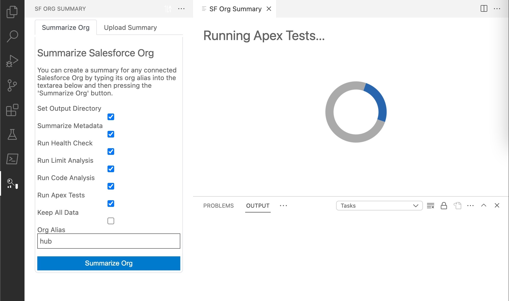
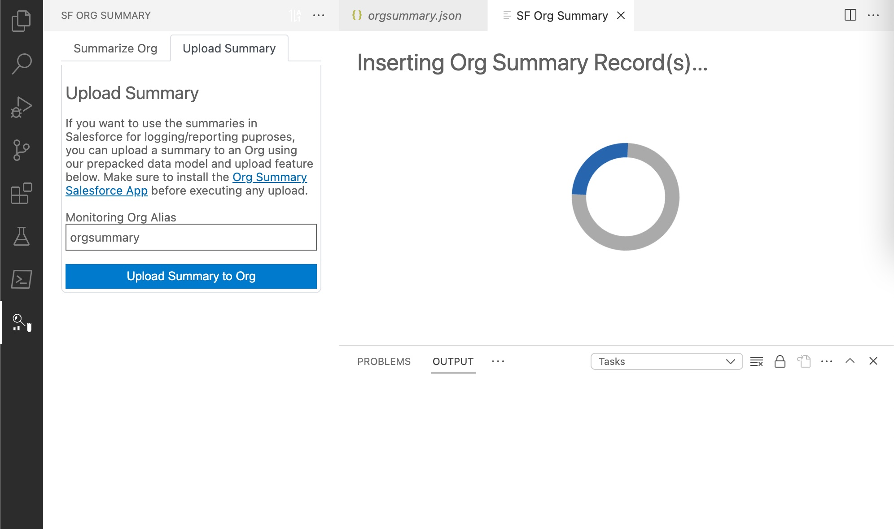

# Salesforce Org Summary - VSCode Extension

Salesforce Org Summary is a powerful tool that extends into the Visual Studio Code environment, providing a seamless experience for understanding and monitoring your Salesforce Org instance(s). This extension allows you to initiate the summarization process conveniently from the sidebar, offering valuable insights into key metadata, test results, code metrics, usage of limit-related resources, and more.

## Features

### Component Summary

Aggregate and track metadata details using the Tooling API. Get a quick overview of component totals, including the last modified date.

### Tests Summary

Run Apex tests and analyze the health of your codebase directly from Visual Studio Code. Evaluate the overall test coverage of your Apex code and Flows.

### Org Limits Overview

Fetch actual usage related to Salesforce Org limits within the VSCode environment to ensure you stay within the allowed thresholds.

### Code Analysis

Identify and analyze potential risks in your codebase for Apex and JavaScript without leaving your development environment. Receive insights into various aspects such as severity, file location, and suggested improvements.

### Health Check Score

Assess the health of your Salesforce instance with a comprehensive health check score. Understand the amount of open risks versus compliance directly within Visual Studio Code.

## Installation

Install the Salesforce Org Summary VSCode extension seamlessly into your development environment:

1. Open Visual Studio Code.
2. Go to Extensions (you can use `Ctrl+Shift+X`).
3. Search for "Salesforce Org Summary" and click Install.

## Summarize An Org
    
1. Open the Salesforce Org Summary sidebar.
2. Enter the alias of the Salesforce Org connection in the provided text area. Alternatively, use the dropdown arrow to select from a list of prefetched connections.
3. Configure summarization preferences with checkboxes for each feature.
4. Click the "Summarize Org" button to initiate the summary process.

## Uploading Summary to Salesforce

The extension provides functionality to upload summarized data to Salesforce. Use the following steps to enhance your monitoring capabilities:
    
1. After the summary process, explore the generated summary files and go to the Upload Tab.
2. Enter the alias of the Salesforce Org connection in the provided text area. Alternatively, use the dropdown arrow to select from a list of prefetched connections.
4. Click the "Upload Summary to Org" button to initiate the summary process.

